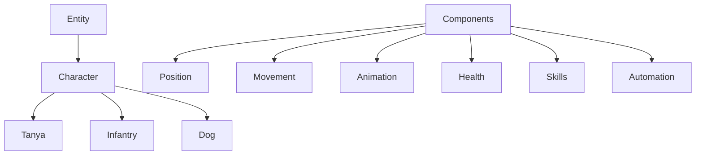

# Core Module Architecture

This module implements a component-based entity system with a focus on maintainability and extensibility. It follows SOLID principles and uses TypeScript for type safety.

## Architecture Overview



### Key Components

- **Entity**: Base class for all game entities
- **Character**: Base class for all playable/AI characters
- **Components**: Modular pieces of functionality
  - Position: Handles entity position and spatial calculations
  - Movement: Handles entity movement and direction
  - Animation: Handles sprite animations and effects
  - Health: Handles damage and health state
  - Skills: Handles character abilities and cooldowns
  - Automation: Handles AI behavior and targeting

### Interfaces

- **Moveable**: For entities that can move
- **Animateable**: For entities with animations
- **Attackable**: For entities that can take damage
- **Skillable**: For entities that can use skills
- **Automatable**: For entities with AI behavior

## Feature Flags

The system uses feature flags to control the rollout of new components:

```typescript
export const FeatureFlags = {
    USE_POSITION_COMPONENT: false,
    USE_MOVEMENT_COMPONENT: false,
    USE_ANIMATION_COMPONENT: false,
    USE_HEALTH_COMPONENT: false,
    USE_SKILL_COMPONENT: false,
    USE_AUTOMATION_COMPONENT: false
};
```

## Creating Characters

Use the character factory to create new instances:

```typescript
const tanya = createCharacter({
    type: 'tanya',
    position: { x: 100, y: 100 }
});

const infantry = createCharacter({
    type: 'infantry',
    position: { x: 200, y: 200 }
});

const dog = createCharacter({
    type: 'dog',
    position: { x: 300, y: 300 }
});
```

## Component System

Each component is self-contained and handles a specific aspect of entity behavior:

```typescript
class Character extends BaseEntity {
    protected positionComponent?: PositionComponent;
    protected movementComponent?: MovementComponent;
    protected healthComponent?: HealthComponent;
    protected animationComponent?: AnimationComponent;
    protected skillComponent?: SkillComponent;
    protected automationComponent?: AutomationComponent;
}
```

Components are initialized based on feature flags and configuration:

```typescript
protected initializeComponents(): void {
    if (FeatureFlags.USE_POSITION_COMPONENT) {
        this.positionComponent = this.addComponent(
            ComponentKeys.position,
            new PositionComponent(this, config)
        );
    }
    // ... other components
}
```

## Adding New Characters

1. Create a new character class extending `Character`
2. Define character-specific configuration interface
3. Implement character-specific behavior
4. Add to character factory

Example:
```typescript
export interface NewCharacterConfig extends CharacterConfig {
    specialAbilityDamage: number;
}

export class NewCharacter extends Character {
    constructor(config: NewCharacterConfig) {
        super({
            ...config,
            health: { maxHealth: 75 },
            movement: { baseSpeed: 6 }
        });
    }
}
```

## Adding New Components

1. Create component interface
2. Create component implementation
3. Add to feature flags
4. Add to character base class
5. Initialize in relevant characters

## Best Practices

1. Use composition over inheritance
2. Keep components focused and single-purpose
3. Use interfaces for loose coupling
4. Implement feature flags for safe rollout
5. Follow TypeScript best practices
6. Document public APIs
7. Write unit tests for components
